<h1 align="center">📚 OpenLibrary Book Explorer</h1>

<p align="center">
  📱 <strong>A Flutter + Open Library API Book Finder App</strong>.
</p>

---

### 📋 Project Description

**OpenLibrary Book Explorer** is a **Flutter-based mobile application** that connects with the **Open Library REST API** to fetch and display **books, authors, editions, and subjects** in real time.  
It provides a smooth user experience with **search, filtering, and Firebase-powered favorites management**.

Perfect for developers and learners who want to practice **Flutter with REST APIs, Provider state management, Firebase Auth, and Firestore integration**.

It helps you to:

- 🔍 **Search Books by Title, Author, or ISBN**
- 📖 **View Detailed Book Information & Editions**
- 👨‍💻 **Explore Author Profiles & Works**
- ❤️ **Save & Manage Favorites with Firebase**
- 📂 **Browse by Popular Subjects & Categories**
- ⚡ **Learn REST API Integration in Flutter**

---

### 🧰 Features

- ✅ Splash Screen with Auth Check (Firebase)
- ✅ Home Screen with:
    - Trending section
    - Categories section
    - Author section
    - Favorites section (if signed in)
- ✅ Search Screen:
    - Filter by All / Title / Author
    - Infinite scroll results
- ✅ Work Detail Screen:
    - Book cover, title, authors
    - Add/Remove Favorites
- ✅ Editions Screen:
    - Browse all editions
    - Filter by year and language
- ✅ Author Screen:
    - Author photo, bio, and works
- ✅ Favorites Screen synced with Firestore
- ✅ Settings Screen with cache controls & UI options
- ✅ Provider State Management
- ✅ Error, Loading & Empty States
- ✅ Clean & Minimal UI

---

### 🔧 Tech Stack

- **Flutter** – Cross-platform framework
- **Dart** – Language powering Flutter
- **Provider** – State management
- **Open Library API** – For books, authors, editions, and subjects
- **HTTP Package** – API requests
- **Firebase Auth** – Google + Email/Password authentication
- **Firestore** – Favorites storage
- **SharedPreferences** – Local cache (searches, results, covers)

---

### 📱 Screenshots

| Splash Screen                                               | OnBoarding Screen                                         |
|-------------------------------------------------------------|-----------------------------------------------------------|
|  | 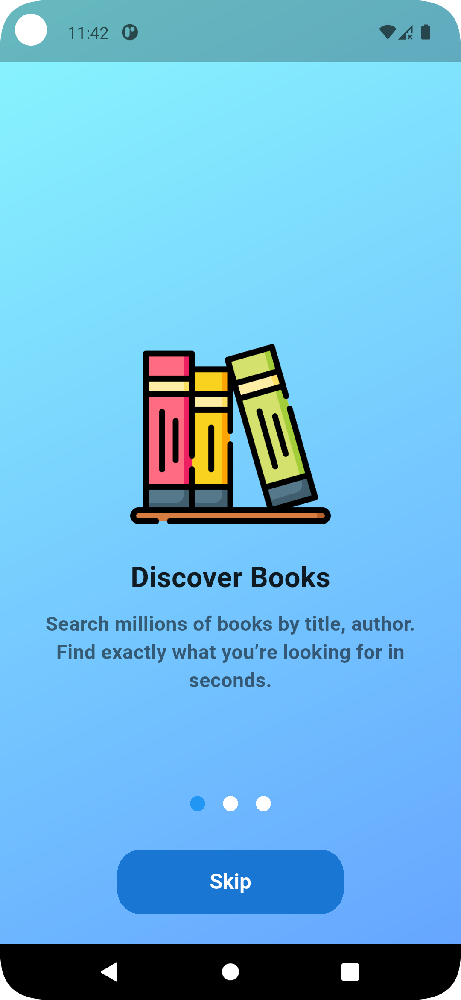 |


| Home Screen                                               | Trending Screen                                               |
|-----------------------------------------------------------|---------------------------------------------------------------|
| 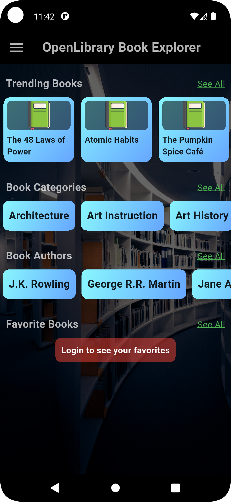 | 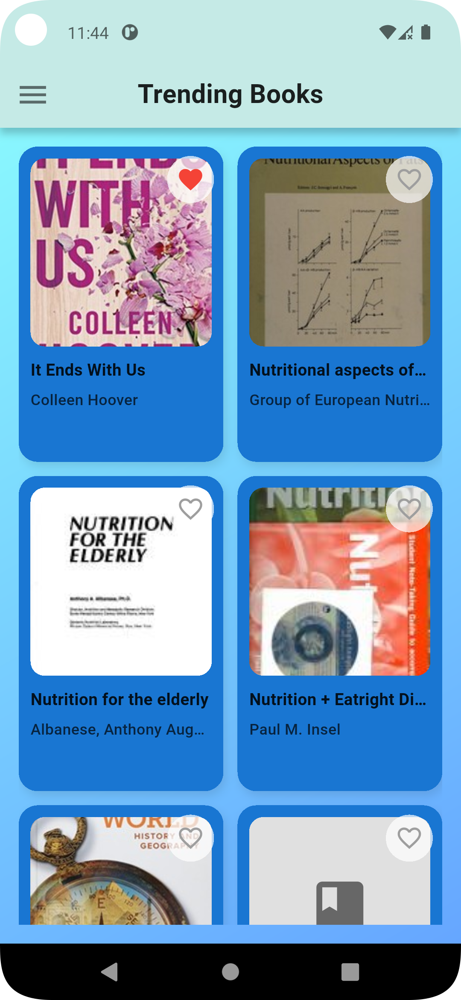 |


| Categories Screen                                               | Individual Category Screen                                         |
|-----------------------------------------------------------------|--------------------------------------------------------------------|
| 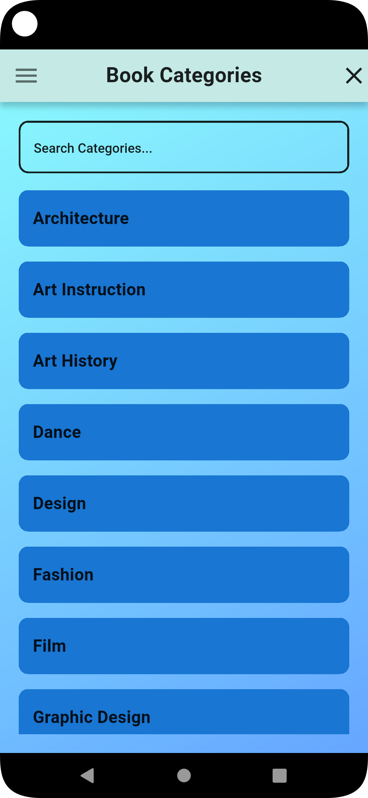 | 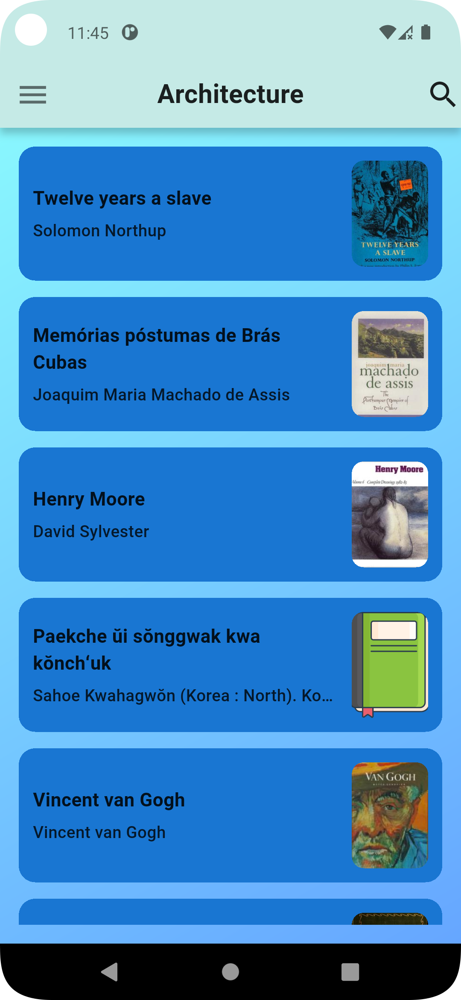 |


| Author Screen                                               | Waiting Card Screen                                        |
|-------------------------------------------------------------|------------------------------------------------------------|
| 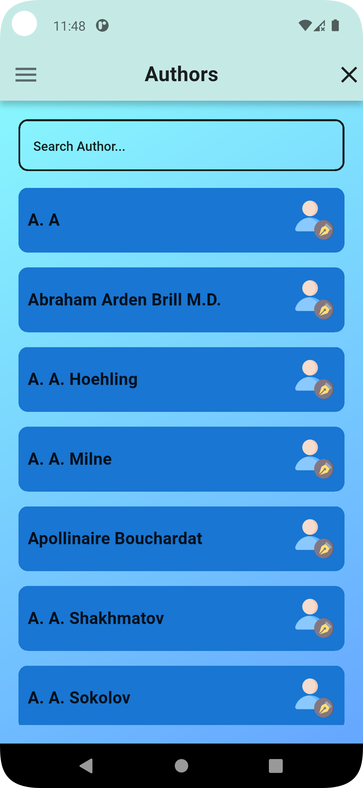 | 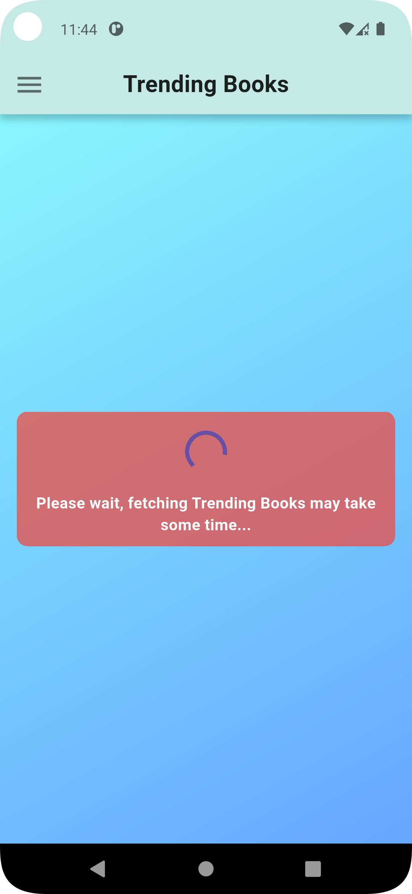 |


| Help Screen                                               | Contact Us Screen                                        |
|-----------------------------------------------------------|----------------------------------------------------------|
| 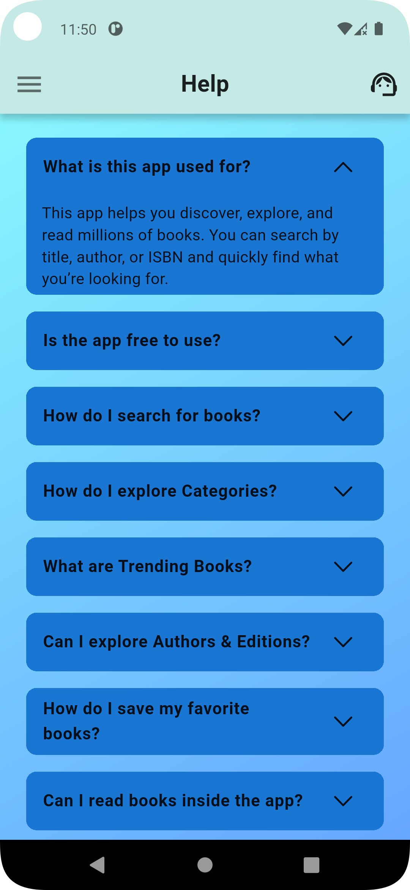 | 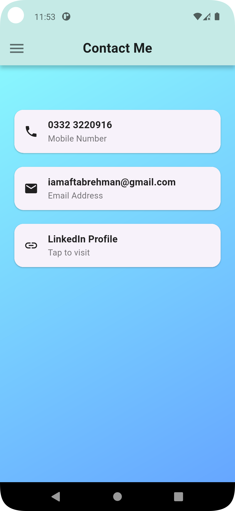 |


| Dark Mode Screen                                        | Favorite Screen                                              |
|---------------------------------------------------------|--------------------------------------------------------------|
| 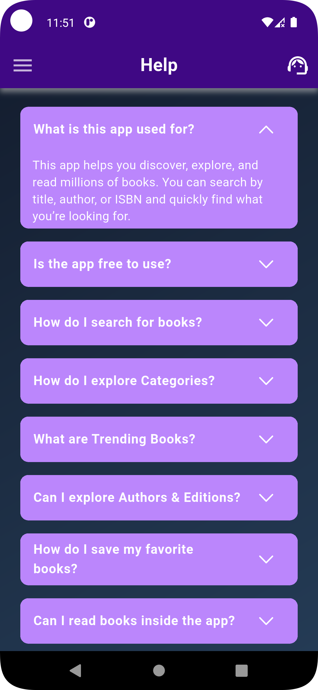 | 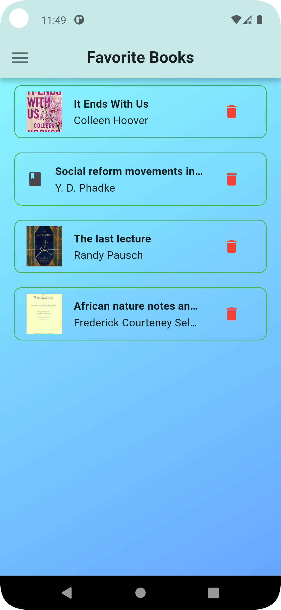 |


| Drawer Login Screen                                            | Sign Up Screen                                              |
|----------------------------------------------------------------|-------------------------------------------------------------|
| 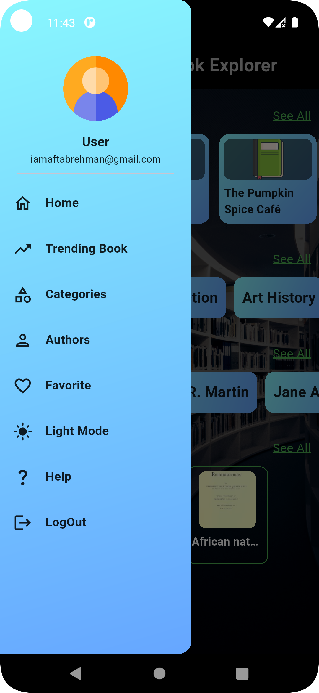 | 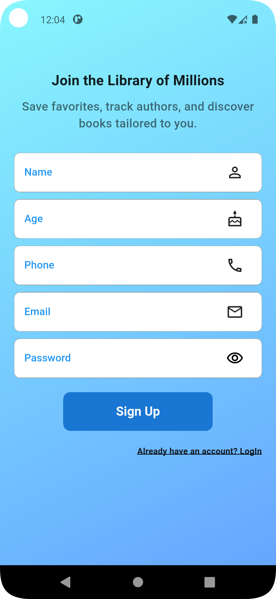 |


| LogIn Screen                                               | LogOut Screen                                         |
|------------------------------------------------------------|-------------------------------------------------------|
|  | 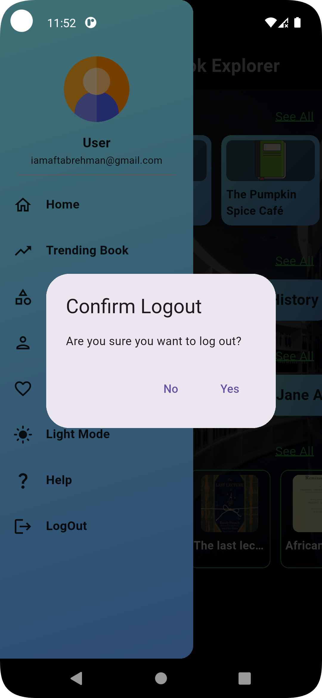 |
---

### 🏁 Getting Started

To get started with this project, follow these steps:

1. Clone the repository:
    ```bash
    git clone https://github.com/IAftabRehman/OpenLibrary-Book-Explorer-API-Flutter.git
    ```

2. Navigate to the project directory:
    ```bash
    cd OpenLibrary-Book-Explorer-API-Flutter
    ```

3. Install dependencies:
    ```bash
    flutter pub get
    ```

4. Run the app:
    ```bash
    flutter run
    ```

---

### 📦 API Endpoints

- **Search Books:** `/search.json?q=flutter`
- **Work Details:** `/works/{WORK_ID}.json`
- **Editions:** `/works/{WORK_ID}/editions.json`
- **Author Details:** `/authors/{AUTHOR_ID}.json`
- **Author Works:** `/authors/{AUTHOR_ID}/works.json`
- **Subjects:** `/subjects/{subject}.json`
- **Covers:** `https://covers.openlibrary.org/b/id/{cover_i}-M.jpg`

---

### 💬 Ask Me Anything!

Got suggestions or feedback? Feel free to contact:

📧 **Email:** iamaftabrehman@gmail.com  
🧑‍💻 **GitHub:** [IAftabRehman](https://github.com/IAftabRehman)  
💼 **LinkedIn:** [Aftab Rehman](https://www.linkedin.com/in/aftab-rehman)

---

### 📊 GitHub Stats

<div align="center">
  
  
</div>

---

<p align="center">
  🌟 Star this repo if it helped you!  
  <br/>
  Made with ❤️ by <a href="https://github.com/IAftabRehman">IAftabRehman</a>
</p>
